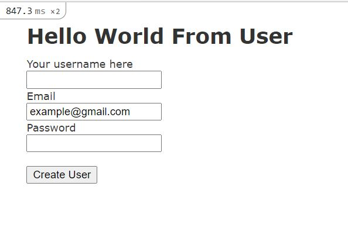

# Rails-Forms

This is part of the Forms Project in The Odin Project’s Ruby on Rails Curriculum. You can find the project requirements [here](http://www.theodinproject.com).
In this project we are using the form_for helper methods provided by Rails to do [new, create, edit, update, and show operations].

## Instructions

1. Download a clone locally git clone https://github.com/FrederickMih/Rails-Forms/tree/development
2. Enter the project folder cd micro-reddit
3. Download the proper branch git checkout Rails-form
4. Install the necessary gems bundle install
5. Migrate the database rails db:migrate
6. Start the Rails server by using "rails server" command
6. You can now create new users by going to http://127.0.0.1:3000/users/new
8. View existing users by going to http://127.0.0.1:3000/users/[userId]
9. Update existing users by going to http://127.0.0.1:3000/users/[userId]/edit

## Authors :bust_in_silhouette:

### Frederick Mih

\_[Github](https://github.com/FrederickMih)
\_[LinkedIn](https://www.linkedin.com/in/frederick-mih/)

### Ayman Jabr

\_[Github](https://github.com/AymanJabr/)
\_[LinkedIn](https://www.linkedin.com/in/ayman-jabr-3705a4100/)

## Show your support :star:️:star:️:star:️
Give a star if you like this project!

## License :memo:
This project is [MIT](https://www.mit.edu/~amini/LICENSE.md) licensed.
